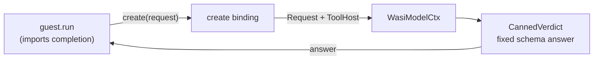

# Model completion (canned)

Proves the deterministic side of the `wasi-model` boundary: a guest calls `create` across the `omnia:model/completion` boundary and receives a **deterministic** answer from an example-local canned backend — no live model, no network.

## What it shows

- `guest` ([`guest.rs`](guest.rs)) **imports** `omnia:model/completion` and exposes an async `run`. In its default scenario it builds a `json-schema` prompt, assembling the `system` / `messages` channels with the guest-side `Sections` builder (role / task / context), reads the preopen table via `wasi:filesystem/preopens` and lends the workspace named `.` through `grants.workspace`, then completes the request.
- [`runtime.rs`](runtime.rs) binds the `WasiModel` host to the example-local `CannedVerdict` backend — an inline `WasiModelCtx` impl that answers every completion with one fixed schema answer.
- [`omnia.toml`](omnia.toml)'s `[[mount]]` preopens the repo root as a read-only workspace named `.`. The host resolves the lent descriptor back to that mount by directory identity; the canned backend ignores it (it never runs tools).



The runtime core stays generic (Law 2): no model id, provider, or schema dialect lives in Omnia, and nothing in the host validates the answer — the `format` steers the provider, and a guest that wants to judge candidates sets `request.check`. The boundary only ever hands the guest an **answer string**. The canned backend never calls tools or checks; live tool-call and check paths are exercised by the `omnia-genai` backend in the `omnia-backends` repo.

## Quick Start

```bash
make build model
```

Or, more manually, for debugging:

```bash
# build the guest
cargo build -p examples --example model-wasm --target wasm32-wasip2
```

This emits `target/wasm32-wasip2/debug/examples/model_wasm.wasm` (the underscored name the manifest points at).

## Run

The answer is canned in the runtime binary, so no configuration is needed.
The manifest is compiled in via `runtime!`'s `config:` key, which makes this
command-mode binary a direct command — no `run` subcommand, argv passes to the
guest verbatim:

```bash
export RUST_LOG=info,opentelemetry_sdk=off
cargo run --example model
```

